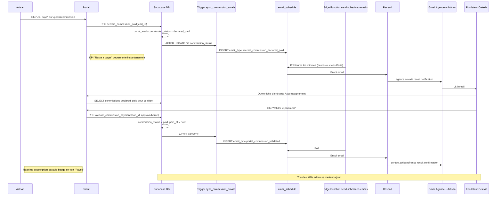
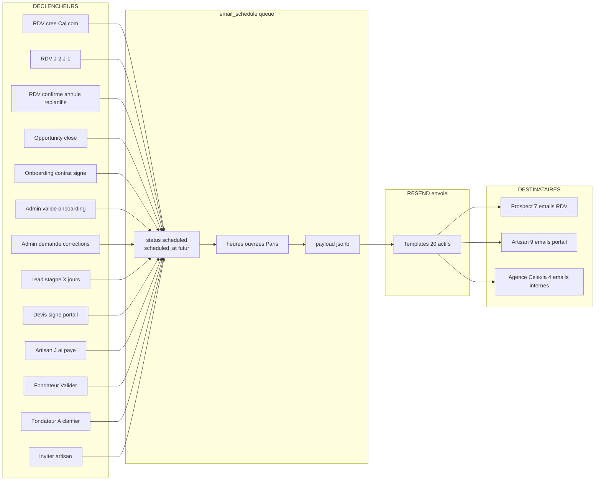
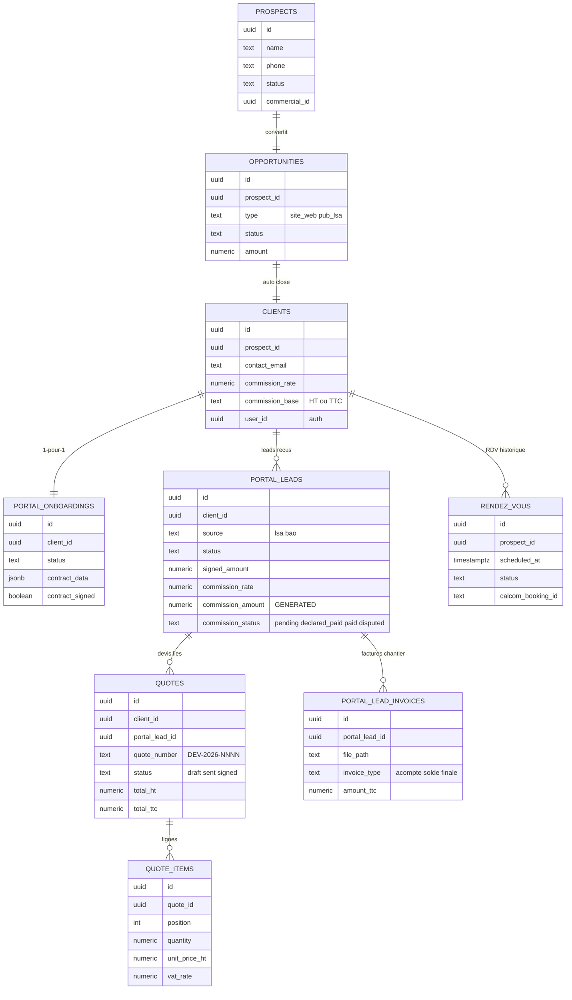

# CRM Celexia · Mappage complet

Cartographie de A à Z du système : admin CRM ↔ backend Supabase ↔ portail artisan.
GitHub rend automatiquement les diagrammes ci-dessous. Si tu lis ce fichier
ailleurs (VS Code, Notion), installe une extension Mermaid pour le rendu.

---

## Chiffres clés

| Mesure | Valeur |
|---|---|
| Pages admin | 28 routes |
| Pages portail artisan | 13 routes (onboarding + dashboard) |
| Tables Postgres principales | 7 (+ 30 secondaires) |
| Triggers DB actifs | 33 |
| RPCs SECURITY DEFINER | 6 |
| Edge Functions | 8 |
| Templates email actifs | 20 |
| Migrations SQL | 101 |
| Realtime subscriptions | 3 channels |
| Hooks React Query | 27 |

---

## 1. Architecture globale

Vue d'ensemble des 3 plans (admin · backend · portail artisan) avec leurs
interconnexions principales.

```mermaid
flowchart LR
    subgraph A["ADMIN CRM · agence.celexia"]
        direction TB
        A1["Dashboard founder<br/>KPIs CA Commissions"]
        A2["Prospects<br/>10 statuts"]
        A3["Opportunities<br/>Site Web Pub LSA"]
        A4["RDV Calendrier<br/>Cal.com"]
        A5["Clients<br/>fiche complete"]
        A6["Accompagnement<br/>5 etapes"]
        A7["Onboardings admin<br/>validation"]
        A8["Followup commissions"]
        A9["Devis Billing"]
        A10["Performance Analytics"]
    end
    subgraph B["BACKEND SUPABASE"]
        direction TB
        BT1["prospects"]
        BT2["opportunities"]
        BT3["rendez_vous"]
        BT4["clients"]
        BT5["portal_onboardings"]
        BT6["portal_leads"]
        BT7["quotes + items"]
        BX["33 Triggers"]
        BR["6 RPCs SECURITY DEFINER"]
        BE["8 Edge Functions"]
        BQ["email_schedule queue"]
    end
    subgraph P["PORTAIL ARTISAN · contact.artisan"]
        direction TB
        P1["Onboarding<br/>6 etapes"]
        P2["Dashboard<br/>bandeau ROI"]
        P3["Leads kanban<br/>LSA + BAO"]
        P4["Fiche lead<br/>signature + factures"]
        P5["Devis editeur PDF"]
        P6["Commissions<br/>J ai paye"]
        P7["Parametres"]
        P8["Documents"]
    end
    A2 --> BT1
    A3 --> BT2
    A4 --> BT3
    A5 --> BT4
    A6 --> BT5
    A7 --> BT5
    A8 --> BR
    A9 --> BT7
    BT1 -- sync trigger --> BT2
    BT2 -- auto close --> BT4
    BT4 -- init steps --> BT5
    BT5 -- sync commission --> BT4
    BE -- calcom webhook --> BT3
    BT3 -- schedule emails --> BQ
    BE -- LSA cron --> BT6
    P1 --> BT5
    P3 --> BT6
    P4 --> BR
    P5 --> BT7
    P6 --> BR
    BT7 -- sync signed --> BT6
    BT6 -- commission email --> BQ
    BQ -- send cron --> Resend["Resend"]
    Resend --> Gmail1["Gmail agence"]
    Resend --> Gmail2["Gmail artisan"]
    Resend --> Gmail3["Prospect client final"]
```

---

## 2. Cycle de vie d'un artisan (acquisition → onboarding → activité)

Le parcours complet d'un artisan dans le système, du premier appel commercial
jusqu'à la première commission encaissée.

```mermaid
flowchart TD
    P1["Prospect cree manuellement ou import CSV"]
    P2["Appel logge<br/>statut a rappeler ou rdv pris"]
    P3["RDV planifie<br/>via Cal.com webhook"]
    P4["4 emails programmes auto<br/>confirmation + rappels + trust builder"]
    P5["RDV realise"]
    P6["Opportunity creee<br/>Site Web ou Pub"]
    P7["Devis envoye<br/>opportunity status proposal"]
    P8["Signature contrat<br/>opportunity close"]
    P9["Client cree automatiquement<br/>+ 5 etapes accompagnement"]
    P10["Invitation portail envoyee<br/>email portal_invitation"]
    P11["Onboarding 6 etapes self-service<br/>welcome contract payment gmb legal pending"]
    P12["Fondateur valide<br/>portal_onboardings.status validated"]
    P13["Email artisan<br/>portal_onboarding_validated"]
    P14["Acces au CRM artisan debloque"]
    P15["Leads LSA pushed par Edge Function<br/>lsa-leads-sync cron"]
    P16["Artisan signe un devis<br/>quote.status signed"]
    P17["Trigger sync_signed_quote_to_lead<br/>portal_lead.status signe"]
    P18["Email artisan<br/>Bravo nouveau devis signe"]
    P19["Artisan clique J ai paye<br/>commission_status declared_paid"]
    P20["Email agence<br/>internal_commission_declared_paid"]
    P21["Fondateur valide<br/>commission_status paid"]
    P22["Email artisan<br/>Commission validee merci"]
    P1 --> P2 --> P3 --> P4 --> P5 --> P6 --> P7 --> P8
    P8 --> P9 --> P10 --> P11 --> P12 --> P13 --> P14
    P14 --> P15 --> P16 --> P17 --> P18
    P18 --> P19 --> P20 --> P21 --> P22
```



---

## 3. Sequence diagram · Cycle commission complet

La séquence détaillée entre l'artisan, la DB, le pipeline email, et le
fondateur lors d'un paiement de commission.



---

## 4. Pipeline email · Tous les déclenchements

Les 20 templates d'emails actifs, leur déclencheur, leur destinataire.



---

## 5. ER diagram · Tables principales

Schéma relationnel simplifié des 10 tables au cœur du système.



---

## 6. Triggers DB · Mapping par table

Les 33 triggers actifs avec leur table source et leur effet.

| Table | Trigger | Effet |
|---|---|---|
| `prospects` | sync_prospect_to_opportunity | Crée/sync opportunity bidirectionnel (00028) |
| `prospects` | sync_prospect_contact_to_client | Propage nom/email vers client si converti |
| `opportunities` | auto_create_client_on_close | Status='close' → crée client + init accompagnement |
| `opportunities` | sync_opportunity_to_prospect | Sens inverse du sync (00028) |
| `opportunities` | on_opp_close_notify_team | Email interne agence |
| `rendez_vous` | schedule_rdv_emails | Programme 4 emails (confirmation + 2 rappels + trust) |
| `rendez_vous` | on_rdv_status_email | Email selon status (confirmé/annulé/etc.) |
| `rendez_vous` | on_rdv_noshow_set_recall | Crée reminder auto si noshow |
| `rendez_vous` | on_rdv_rescheduled | Email + reprogrammation |
| `rendez_vous` | cancel_rdv_emails_on_status | Annule emails programmés si RDV annulé |
| `clients` | init_client_accompagnement | Crée les 5 étapes post-signature |
| `clients` | enforce_clients_artisan_invariants | Verrouille colonnes immutables |
| `clients` | propagate_client_commission_rate_to_leads | Sync taux contrat → portal_leads (00101) |
| `portal_onboardings` | sync_contract_commission_to_client | contract_data → clients.commission_rate/base |
| `portal_onboardings` | sync_portal_to_accompagnement | Étape complétée → bascule client_accompagnement_steps |
| `portal_onboardings` | trigger_portal_contract_signed_email | Email interne agence |
| `portal_onboardings` | trigger_portal_validated_email | Email artisan validation |
| `portal_onboardings` | trigger_portal_corrections_email | Email artisan corrections |
| `portal_leads` | enforce_portal_leads_artisan_invariants | Force source='bao' pour inserts artisan |
| `portal_leads` | sync_portal_lead_commission_rate | Sync depuis clients.commission_rate (00101) |
| `portal_leads` | on_portal_lead_signed | Email "Bravo nouveau devis signé" |
| `portal_leads` | sync_commission_status_emails | 3 emails selon transition status |
| `portal_leads` | trigger_portal_lead_created_event | Audit timeline |
| `quotes` | generate_quote_number | Auto-numérote DEV-2026-NNNN |
| `quotes` | enforce_quote_has_lead | Refuse devis non-brouillon sans lead |
| `quotes` | sync_sent_quote_to_lead | Status=sent → lead.status=devis |
| `quotes` | sync_signed_quote_to_lead | Status=signed → lead.status=signe + propagation coords |

---

## 7. Edge Functions · Services serverless

| Function | Trigger | Rôle |
|---|---|---|
| `send-scheduled-emails` | Cron 1 min | Lit `email_schedule`, envoie via Resend, marque sent/failed |
| `calcom-webhook` | Webhook Cal.com | Reçoit booking → crée `rendez_vous` |
| `confirm-rdv-presence` | Lien dans email RDV | Confirme la présence prospect |
| `cancel-rdv-presence` | Lien dans email RDV | Annule + reprogramme |
| `reschedule-rdv-presence` | Lien dans email RDV | Replanifie |
| `rdv-ical` | URL publique | Génère le .ics pour calendar prospect |
| `lsa-leads-sync` | Cron / manuel | Poll Google Local Services Ads → `portal_leads` |
| `portal-invite` | Admin "Inviter" | Crée compte Supabase Auth + email d'invitation |

---

## 8. KPIs affichés · Source de vérité

| KPI | Page | Source SQL |
|---|---|---|
| CA ce mois (admin) | Dashboard founder | `SUM(devis.amount_ht WHERE signed_at >= début mois)` |
| Commissions encaissées ce mois | Dashboard founder | `SUM(portal_leads.commission_amount WHERE commission_status='paid' AND commission_paid_at >= début mois)` |
| Commissions en attente | Dashboard founder | `SUM(portal_leads.commission_amount WHERE commission_status IN pending/declared_paid/disputed)` |
| Validations en attente | Dashboard founder | `COUNT(portal_leads WHERE commission_status='declared_paid')` |
| Commission générée (client) | Fiche client | `SUM(portal_leads.commission_amount WHERE status='signe')` |
| Commission encaissée (client) | Fiche client | `SUM(portal_leads.commission_amount WHERE commission_status='paid')` |
| Reste à payer ce mois (artisan) | /portal/commission | `SUM(commission_amount WHERE signed_at >= début mois AND commission_status IN pending/disputed)` |
| ROI Celexia 30j (artisan) | /portal/dashboard | `SUM(signed_amount) / SUM(commission_amount)` sur 30 jours |
| Leads ce mois | Dashboard artisan | `COUNT(portal_leads WHERE created_at >= début mois)` |
| Devis envoyés | Dashboard artisan | `COUNT(portal_leads WHERE status='devis')` |
| Devis signés | Dashboard artisan | `COUNT(portal_leads WHERE status='signe')` |

---

## 9. Garanties techniques

- **Anti-récursion** : tous les triggers protégés par `pg_trigger_depth() > 1`
- **RLS** : 100% des tables ont des policies (admin via `is_founder()`, artisan via `client_id IN (SELECT id FROM clients WHERE user_id=auth.uid())`)
- **RPCs SECURITY DEFINER** : 6 fonctions avec vérif d'ownership stricte (commission, signature, soft-delete)
- **Soft-delete** : `deleted_at` partout, audit trail conservé (jamais de hard DELETE)
- **Source unique de vérité** commission : `portal_leads.commission_*` (table legacy `commissions` dropée en 00100)
- **Realtime** : 3 channels (`portal_leads`, `client_accompagnement_steps`, `team_notes`) → invalidations React Query auto
- **Heures ouvrées Paris** : pipeline emails respecte 9h-19h hors weekend
- **Timezone-safe** : `Intl.DateTimeFormat({timeZone: 'Europe/Paris'})` partout (Edge Functions tournent en UTC)
- **0 régression** observée sur 3 phases d'audit Cowork consécutives

---

*Doc générée le 13/05/2026. Mise à jour automatique à chaque commit qui touche
`supabase/migrations/`, `src/features/`, ou les Edge Functions.*
